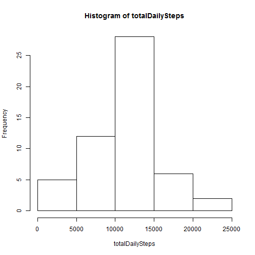
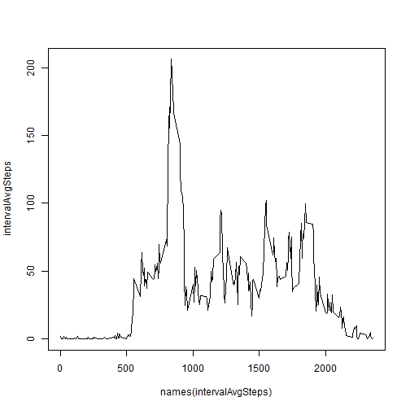
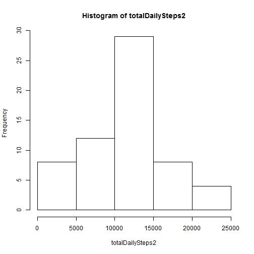
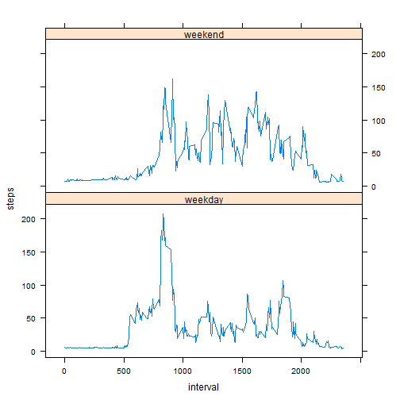

Reproducible Research - Peer Assessment 1
========================================================

First, load the data into R.  Create another version of this data that excludes any missing values.

```r
activityData <- read.csv("D:/Users/TheWolff/Documents/Coursera/Reproducible Research/repdata-data-activity/activity.csv")

activityData$date <- as.Date(activityData$date)

activityDataNonmissing <- activityData[!is.na(activityData$steps), ]
```


Create a histogram of the **steps** field and calculate its mean and median.


```r
totalDailySteps <- tapply(activityDataNonmissing$steps, activityDataNonmissing$date, 
    sum)
hist(totalDailySteps)
```

 


```r
meanDailySteps <- as.integer(mean(totalDailySteps, na.rm = TRUE))
medianDailySteps <- as.integer(median(totalDailySteps, na.rm = TRUE))
```


The mean number of steps is 10766 and the median number of steps is 10765.

Make a time series plot of the 5-minute interval and the average number of steps taken, averaged across all days.


```r
intervalAvgSteps <- with(activityDataNonmissing, tapply(steps, interval, mean))
plot(names(intervalAvgSteps), intervalAvgSteps, type = "l")
```

 

```r

intervalMaxSteps <- names(intervalAvgSteps[intervalAvgSteps == max(intervalAvgSteps)])
```


The 5-minute interval that contains the highest average number of steps is 835.


```r
numNA <- sum(is.na(activityData))
```


The number of missing values in the original data set is 2304.  We'll fill in the missing values using the mean for that 5-minute interval.


```r
intervals <- as.numeric(names(intervalAvgSteps))
intervalMeans <- data.frame(intervals, intervalAvgSteps)

activityData2 <- merge(activityData, intervalMeans, by.x = "interval", by.y = "intervals")

activityDataImputed <- activityData
activityDataImputed$steps[is.na(activityDataImputed$steps)] <- activityData2$intervalAvgSteps[is.na(activityDataImputed$steps)]
```


Create a histogram of the **steps** field and calculate its mean and median.  Due to the way we imputed the missing data, the histogram and mean will not match those from the first instance.


```r
totalDailySteps2 <- tapply(activityDataImputed$steps, activityDataImputed$date, 
    sum)
hist(totalDailySteps2)
```

 


```r
meanDailySteps2 <- as.integer(mean(totalDailySteps2, na.rm = TRUE))
medianDailySteps2 <- as.integer(median(totalDailySteps2, na.rm = TRUE))
```


The mean number of steps is 10889 and the median number of steps is 11015.

We are interested to see if there are differences in total steps on the weekend versus weekday.  To examine this, we take the average total steps across all days classified as a weekday or weekend.

We see that the steps are more evenly spread throughout the day on the weekend, whereas there is a spike around the 830 mark on the weekday, followed by a lower count throughout the rest of the day.


```r
factorWeekday <- factor(ifelse((weekdays(activityData$date) == "Saturday" | 
    weekdays(activityData$date) == "Sunday"), "weekend", "weekday"))

activityDataImputednew <- cbind(activityDataImputed, factorWeekday)

avgStepsIntervalWeekday <- with(activityDataImputednew, tapply(steps, list(interval, 
    factorWeekday), mean))

library(reshape)
mdata <- melt(avgStepsIntervalWeekday, id = c("weekend", "weekday"))
names(mdata) = c("interval", "factorWeekday", "steps")


library(lattice)
xyplot(steps ~ interval | factorWeekday, data = mdata, type = "l", layout = c(1, 
    2))
```

 


